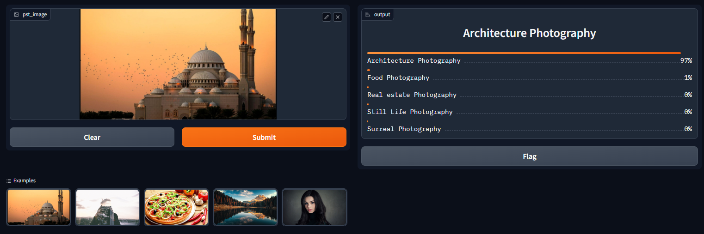

# IC Photography Styles
`🎭 Active`

[`🌐 Website: IC Photography Styles`](https://myte21.github.io/IC.Photography.Styles/)
[`🤗 Hugging Face Space: ic-photography-styles`](https://huggingface.co/spaces/myte/ic-photography-styles)

[IC Photography Styles](https://github.com/MYTE21/IC.Photography.Styles) is a fascinating and cutting-edge machine learning project that aims to identify and distinguish between a broad spectrum of photographic styles. This project can recognize and categorize 25 different types of photographic genres using the most advanced machine learning algorithms. The project is made to automatically assess and categorize photographs based on their distinctive photographic style, from landscape and portrait photography to abstract and fine art photography.


In-depth knowledge of the complexities and subtleties of photography was used to build IC Photography Styles.
An intelligent system
that accurately distinguishes various photographic types was developed by the team after thorough research.
An enormous dataset of pictures from all across the world was used to train the system.

With its cutting-edge features and complex technology,
IC Photography Styles will certainly alter the way we evaluate and classify photographs.
This project is certain to give you insightful knowledge about the various kinds of photography styles available,
whether you're a professional photographer
seeking to improve your craft or a photography enthusiast wanting to explore the world of photography.
Why not try it out for yourself right now and discover what the future of photography holds?

## Project Overview

[IC Photography Styles](https://github.com/MYTE21/IC.Photography.Styles)' primary goal is
to offer an automated method for classifying and identifying various photographic styles.
The project explores significant visual aspects in photographs
by utilizing the strength of machine learning techniques and placing them in one of the 25 categories listed below:

1. **Natural World Photography**
   1. Landscape Photography
   2. Wildlife Photography
   3. Underwater Photography
   4. Astrophotography
   5. Storm Photography
   6. Pet Photography
   7. Macro Photography
   8. Flower Photography
2. **Cityscapes and Structures Photography**
   1. Architecture Photography
   2. Real estate Photography
3. **People Photography**
   1. Portrait Photography
   2. Event Photography
   3. Fashion Photography
   4. Sports Photography
   5. Documentary Photography
4. **Lifestyle Photography**
   1. Street Photography
   2. Wedding Photography
5. **Commercial Photography**
   1. Food Photography
   2. Product Photography
6. **Artistic Photography**
   1. Still Life Photography
   2. Black and White Photography
   3. Fine Art Photography
   4. Double Exposure Photography
   5. Surreal Photography
   6. Abstract Photography

## How It Works

[IC Photography Styles](https://github.com/MYTE21/IC.Photography.Styles) uses sophisticated machine learning methods,
in particular deep learning models,
to categorize and identify the photography styles visible in photos.
In order to train the model,
the project uses an extensive labeled dataset of several photos reflecting various photographic approaches.
Extensive training enables the model to recognize the unique traits and patterns that define each style,
allowing for precise classification of styles.

## Get Started

`Python version 3.10 or 3.11 is required.`

To get started with the IC Photography Styles project, follow these steps:

1. Clone the project repository from GitHub: [IC.Photography.Styles](https://github.com/MYTE21/IC.Photography.Styles.git)

    ```powershell
    git clone https://github.com/MYTE21/IC.Photography.Styles.git
    ```

2. Set up the required dependencies and libraries by executing the following command:

    ```powershell
    pip install -r requirements.txt
    ```

3. Obtain a dataset of images representing the 25 photography styles by executing the following notebook: [data_preprocessing.ipynb](notebooks/data_preprocessing.ipynb).
4. Train the machine learning model using the dataset by executing the following notebook: [training_model_and_cleaning_data.ipynb](notebooks/training_model_and_cleaning_data.ipynb).
5. Now, you can identify the photography style of any image by executing the following commands:

    ```powershell
    cd .\app\
    python app.py
    ```

   Open [http://127.0.0.1:7860](http://127.0.0.1:7860/) in your browser to play with the most recent model:

   

   Or you can visit [Hugging Face Space: ic-photography-styles](https://huggingface.co/spaces/myte/ic-photography-styles) and play with the most recent model.

# Development Journal

## Dataset Preparation
### Data Collection
The dataset is created by utilizing the photography-style type name to download images from the [DuckDuckGo](https://duckduckgo.com/) browser. 
Compiled and saved all the data into the project's [data](data) directory.

### DataLoader
Used [Fast.ai](https://docs.fast.ai/) [Data block API](https://docs.fast.ai/data.block.html) to set up the [DataLoader](https://docs.fast.ai/data.load.html).

### Data Augmentation
[Fast.ai](https://docs.fast.ai/) provides default data augmentation which operates in GPU.

Details can be found in [data_preprocessing.ipynb](notebooks/data_preprocessing.ipynb) notebook.

## Training and Data Cleaning
### Training
Fine-tuned a [RESNET34](https://pytorch.org/vision/main/models/generated/torchvision.models.resnet34.html) 
model for 5 epochs (3 times) and got upto **~81% accuracy**.

### Data Cleaning
This part took the highest time. Since I collected data from browser, there were many noises. Also, 
there were images that contained other categories. I cleaned and updated data using [Fast.ai](https://docs.fast.ai/) 
[ImageClassifierCleaner](https://docs.fast.ai/vision.widgets.html#imageclassifiercleaner:~:text=source-,ImageClassifierCleaner,-ImageClassifierCleaner%20(learn%2C%20opts)). 
I cleaned the data each time after training or fine-tuning, except for the last time which was the final iteration of the model.

## Model Deployment
I deployed to model to [HuggingFace Spaces Gradio App](https://huggingface.co/spaces/myte/ic-photography-styles). 
The implementation can be found in [app](app) folder or [🤗 here](https://huggingface.co/spaces/myte/ic-photography-styles/tree/main).

## API integration with GitHub Pages
The deployed model API is integrated here in [🌐 GitHub Pages Website](https://myte21.github.io/IC.Photography.Styles/). 
Implementation and other details can be found in [docs](docs) folder.

# Contributors
**Project Owner**

|  | Md Yasmi Tohabar | [www.linkedin.com/in/myte/](https://www.linkedin.com/in/myte/) |
|------------------------------------------------------------------|------------------|----------------------------------------------------------------|

## License <a name="license"></a>

The [IC Photography Styles](https://github.com/MYTE21/IC.Photography.Styles) project is released under the [MIT License](https://github.com/MYTE21/IC.Photography.Styles/blob/main/LICENSE).
Feel free to use, modify, and distribute the project in accordance with the license terms.

## Contact <a name="contact"></a>

For any inquiries or questions regarding the [IC Photography Styles](https://github.com/MYTE21/IC.Photography.Styles) project,
please contact at [yasmi.tohabar@gmail.com](mailto:yasmi.tohabar@gmail.com).
We appreciate your interest and feedback.