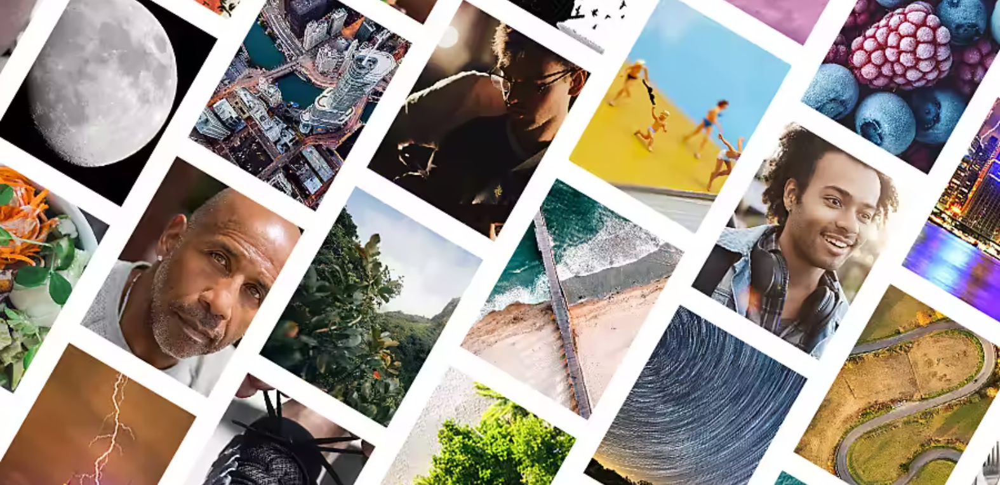

# IC Photography Styles

[IC Photography Styles](https://github.com/MYTE21/IC.Photography.Styles) is a fascinating and cutting-edge machine learning project that aims to identify and distinguish between a broad spectrum of photographic styles. This project can recognize and categorize 25 different types of photographic genres using the most advanced machine learning algorithms. The project is made to automatically assess and categorize photographs based on their distinctive photographic style, from landscape and portrait photography to abstract and fine art photography.

In-depth knowledge of the complexities and subtleties of photography was used to build IC Photography Styles.
An intelligent system
that accurately distinguishes various photographic types was developed by the team after thorough research.
An enormous dataset of pictures from all across the world was used to train the system.

With its cutting-edge features and complex technology,
IC Photography Styles will certainly alter the way we evaluate and classify photographs.
This project is certain to give you insightful knowledge about the various kinds of photography styles available,
whether you're a professional photographer
seeking to improve your craft or a photography enthusiast wanting to explore the world of photography.
Why not try it out for yourself right now and discover what the future of photography holds?

## Project Overview

The main objective of IC Photography Styles is
to provide an automated solution for identifying and categorizing various photography styles.
By leveraging the power of machine learning algorithms,
this project analyzes key visual features in images
and assigns them to one of the following 25 photography style categories:

1. Landscape Photography
2. Portrait Photography
3. Street Photography
4. Wildlife Photography
5. Macro Photography
6. Architectural Photography
7. Documentary Photography
8. Fashion Photography
9. Fine Art Photography
10. Black and White Photography
11. Travel Photography
12. Food Photography
13. Sports Photography
14. Event Photography
15. Night Photography
16. Underwater Photography
17. Aerial Photography
18. Still Life Photography
19. Abstract Photography
20. Conceptual Photography
21. Long Exposure Photography
22. Candid Photography
23. Experimental Photography
24. High-Speed Photography
25. Mobile Photography

## How It Works

IC Photography Styles employs advanced machine learning algorithms, particularly deep learning models, to classify and recognize the photography styles present in images. The project utilizes a large labeled dataset of diverse images representing different photography styles to train the model. Through extensive training, the model learns to extract distinctive features and patterns that characterize each style, enabling accurate style classification.

## Get Started

To get started with the IC Photography Styles project, follow these steps:

1. Clone the project repository from GitHub: [link-to-github-repo]
2. Set up the required dependencies and libraries as mentioned in the project documentation.
3. Obtain a dataset of images representing the 25 photography styles or use the provided sample dataset.
4. Train the machine learning model using the dataset and the provided training scripts.
5. Once the model is trained, you can use it to classify and recognize photography styles in new images.

## Contributions

We welcome contributions to the IC Photography Styles project. If you would like to contribute, please refer to the guidelines outlined in the project repository. Your contributions can help improve the accuracy and performance of the photography style recognition system.

## License

The IC Photography Styles project is released under the [MIT License](link-to-license). Feel free to use, modify, and distribute the project in accordance with the license terms.

## Contact

For any inquiries or questions regarding the IC Photography Styles project, please contact us at [email@example.com](mailto:email@example.com). We appreciate your interest and feedback.

# IC Photography Styles
An Image Recognizer Model To Classify  
25 different types of photography styles:
1. **Natural World Photography [8]**
    1. Landscape Photography ✅
    2. Wildlife Photography ✅
    3. Underwater Photography ✅
    4. Astrophotography ✅
    5. Storm Photography ✅
    6. Pet Photography ✅
    7. Macro Photography ✅
    8. Flower Photography ✅
2. **Cityscapes and Structures Photography [2]**
    1. Architecture Photography ✅
    2. Real estate Photography ✅
3. **People Photography [5]**
    1. Portrait Photography ✅
    2. Event Photography ✅
    3. Fashion Photography ✅
    4. Sports Photography ✅
    5. Documentary Photography ✅
4. **Lifestyle Photography [2]**
    1. Street Photography ✅
    2. Wedding Photography ✅
5. **Commercial Photography [2]**
    1. Food Photography ✅
    2. Product Photography ✅
6. **Artistic Photography [6]**
    1. Still Life Photography ✅
    2. Black and White Photography ✅
    3. Fine Art Photography ✅
    4. Double Exposure Photography ✅
    5. Surreal Photography ✅
    6. Abstract Photography ✅